# PROJECT_StudentSystem

## 1. Description
- Course name: Software Engineering for the Cloud
- Students M2 SE1: FOUR & FENG

## 2. Prerequisite
- Java version: 11.0.21
- minikube version: v1.31.2
- Docker version 24.0.6
- mysql client version 8.1.0 
- mysql server version 8.0.28
- npm version 8.15.0
- git version 2.33.0
- Apache Maven 3.9.5
- IntelliJ IDEA
- Postman
- Docker Desktop
- MySQLWorkbench
- GitHub Actions
- Amazon EKS (Amazon Elastic Kubernetes Service)

## 3. Steps
Open the docker daemon (docker desktop) and go to the project and start the minikube via terminal
    
    minikube start
Check the status if wanted
    
    minikube status
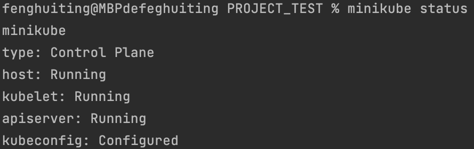
Open the dashboard if wanted
    
    minikube dashboard

### 3.1. Start with a single local service (appbackend-service)
Git clone a backend repository (java spring boot) 

    git clone https://github.com/youtube-arjun-codes/FullStackApp.git
Copy this directory into another new directory to make changes and to git push to our own github repository

    cp -R ./FullStackApp ./AppBackEnd
Remove the old backend repository

    rm FullStackApp
Set up Intellij: settings -> build tool -> choose maven -> apply
Install maven if necessary

    brew install maven
Go to the directory AppBackEnd and build the java application with maven

    mvn clean package
Create a new database named fullstack and a new table named student on MySQL Workbench
Start the MySQL server depending on your operating system
Open a new browser and input 

    http://localhost:8080/student/getAll
Check if the application works correctly, otherwise troubleshoot problems to be able to run the application

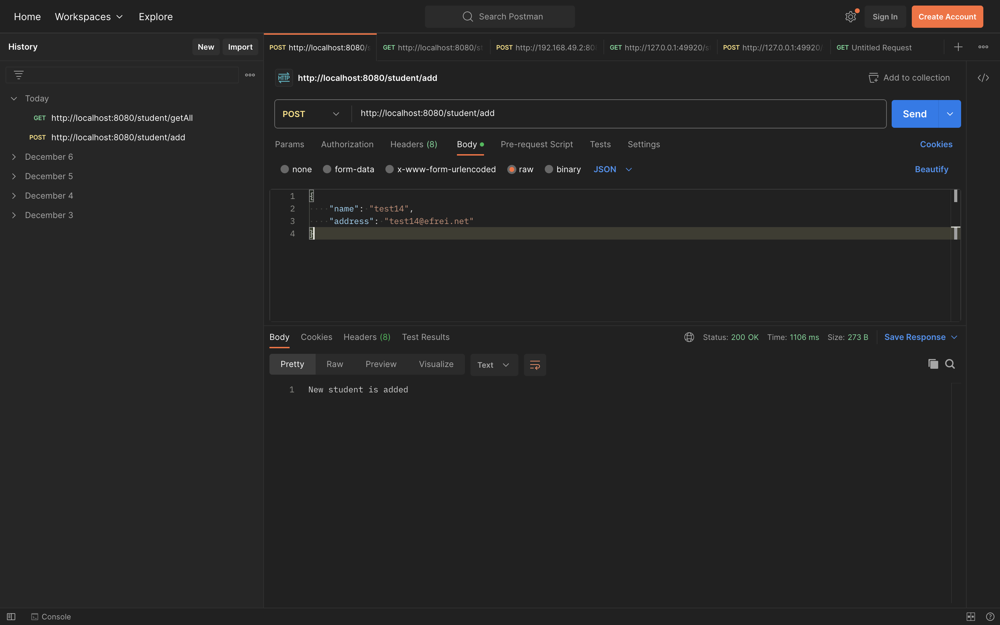
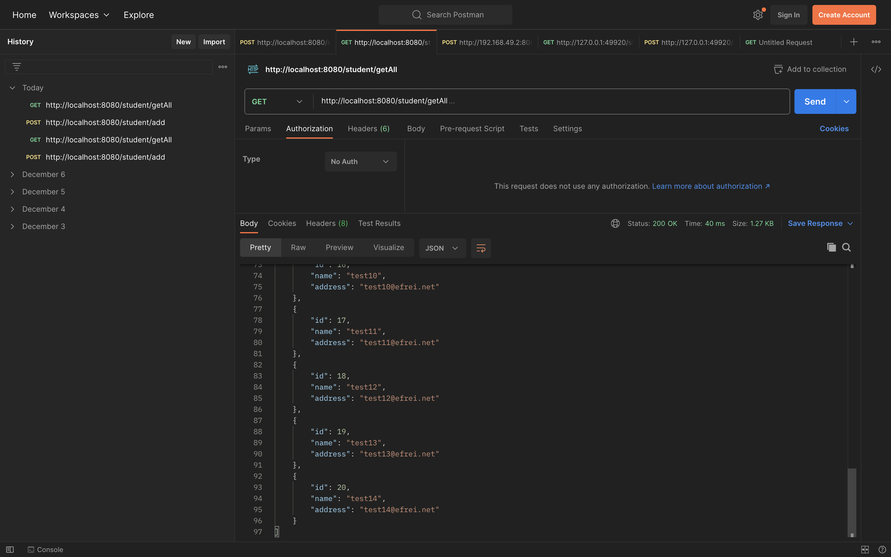
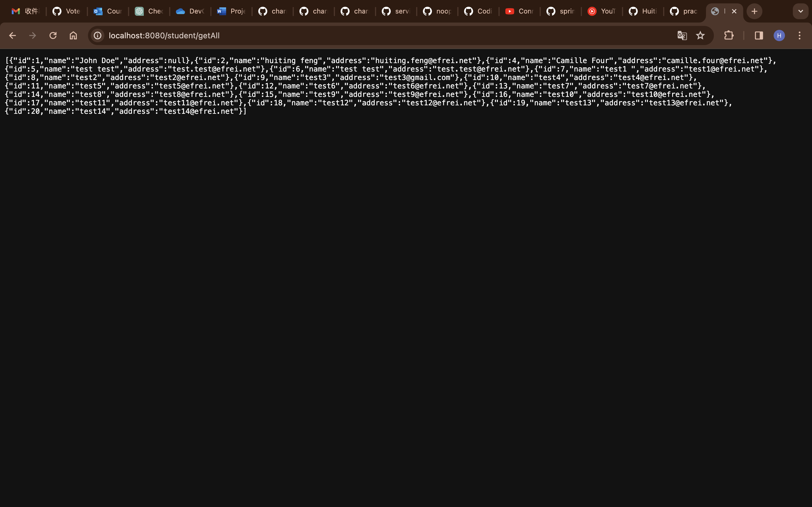
Stop the mysql server to make the port 3306 available
Go to the directory AppBackEnd and create a dockerfile

    cd AppBackend
    touch dockerfile
Copy the provided dockerfile and save it and then create a Docker image (open the docker desktop if necessary)

    docker build --no-cache -t appbackend:$TAG .
Publish the Docker image to the Docker Hub (login if necessary)

    docker images
    docker tag $appbackendImageID $dockerHubID/appbackend:$TAG
    docker push $dockerHubID/appbackend:$TAG

Return to the root of project and create a .yaml files with the provided codes (appbackend-deployment, appbackend-service)
    
    cd ..
    touch app-deployment.yaml
Apply the .yaml to create an appbackend-deployment and an appbackend-service
    
    kubectl apply -f app-deployment.yaml
Check the status if wanted, but it's not finished yet

    kubectl get pods,deployments,svc

### 3.2. Add a local database (mysql)
Go to the directory AppBackEnd and update three parts (pom.xml, src/main/resources/application.properties, src/test)
Go to the root of project and create a .yaml files (db-configMap.yaml, db-deployment.yaml)

    touch db-deployment.yaml
    touch db-configMap.yaml
Copy the corresponding contents and update the information in the db-configMap.yaml
Apply these three .yaml files
    
    kubectl apply -f db-configMap.yaml -f db-deployment.yaml 
Check the status if wanted, but it's not finished yet

    kubectl get pods,deployments,svc

### 3.3. Add a second service (appfrontend-service)
Go to the root of project and git clone a frontend repository (React)
    
    git clone https://github.com/youtube-arjun-codes/FullStackAppFrontEnd.git
Copy this directory into another new directory to make changes and to git push to our own github repository

    cp -R ./$OldGitHubRepoName ./AppFrontEnd
Remove the old frontend repository

    rm $OldGitHubRepoName
Go to the new directory AppFrontEnd and add an .env file
    
    cd AppFrontEnd
    touch .env
Ensure having the correct local gateway (REACT_APP_API_BASE_URL) that routes requests to the appropriate backend system (appbackend-service) and we will use "studentsystem" as local gateway in this project
Update two url to fetch in the file src/components/Student (line 26, 27, 38, 39)
Create a dockerfile in this directory AppFrontEnd 
    
    touch dockerfile
Copy the corresponding content
Create a docker image
    
    docker build --no-cache -t appfrontend:$TAG .
Push the docker image into docker hub (login if necessary)

    docker images
    docker tag $appfrontendImageID $dockerID/appfrontend:$TAG
    docker push $dockerID/appfrontend:$TAG
Return to the root of project and create a .yaml files with the provided codes 

    cd ..
    touch app-configMap.yaml
Add two parts into the app-deployment .yaml file (appfrontend-deployment, appfrontend-service)
Apply the .yaml to create an appfrontend-deployment and an appfrontend-service

    kubectl apply -f app-configMap.yaml -f app-deployment.yaml
Check the status if wanted, but it's not finished yet

    kubectl get pods,deployments,svc
Check if all pods, deployments, services are running correctly as below
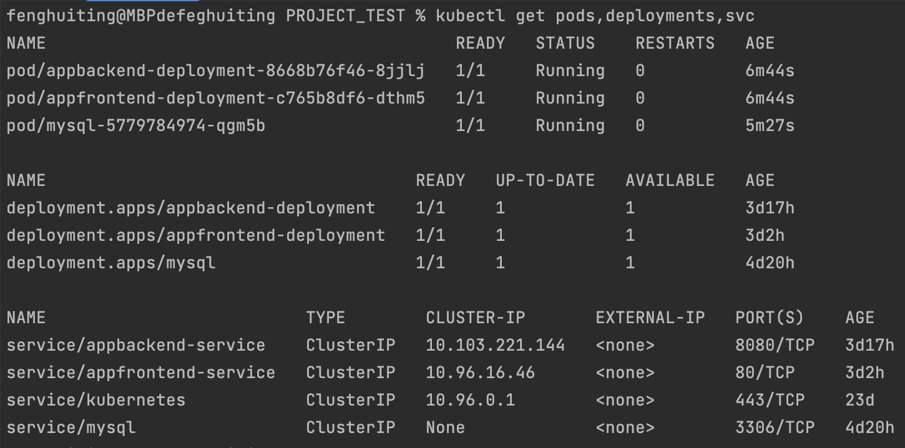
Tape "minikube service appbackend-service" and check in the web browser
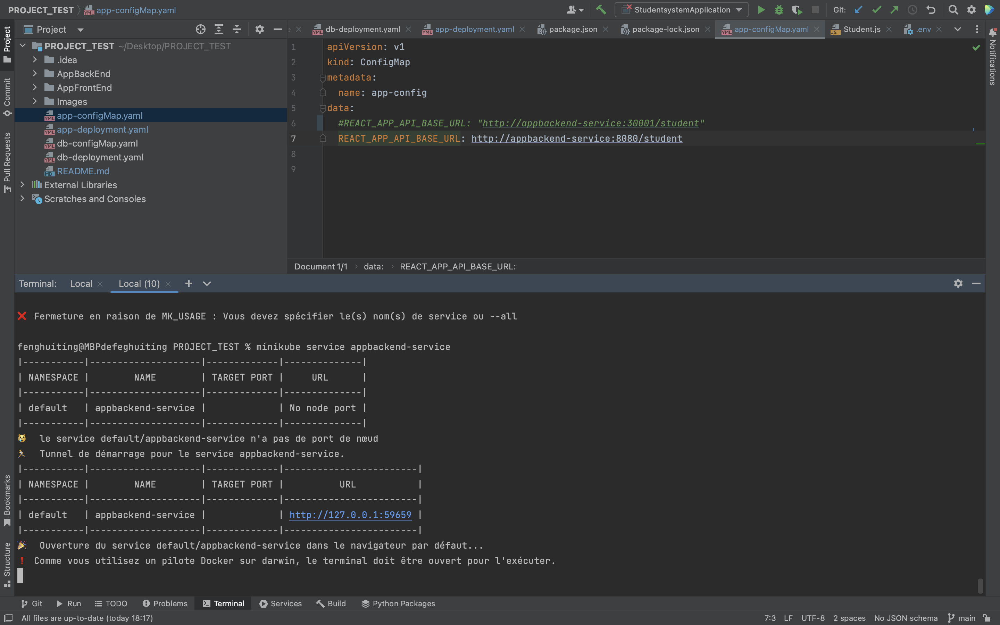
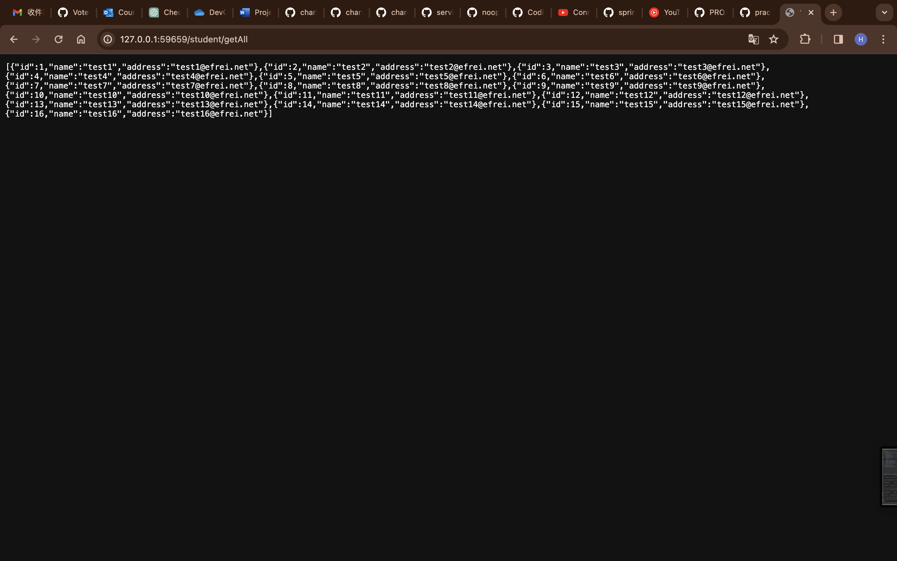
Tap "minikube service appfrontend-service" and check in the web browser
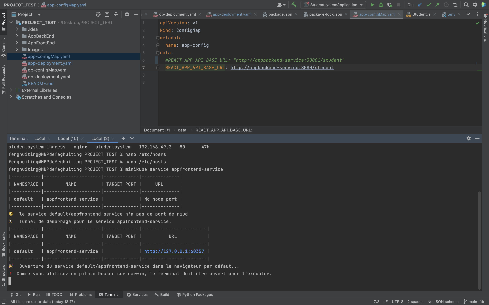
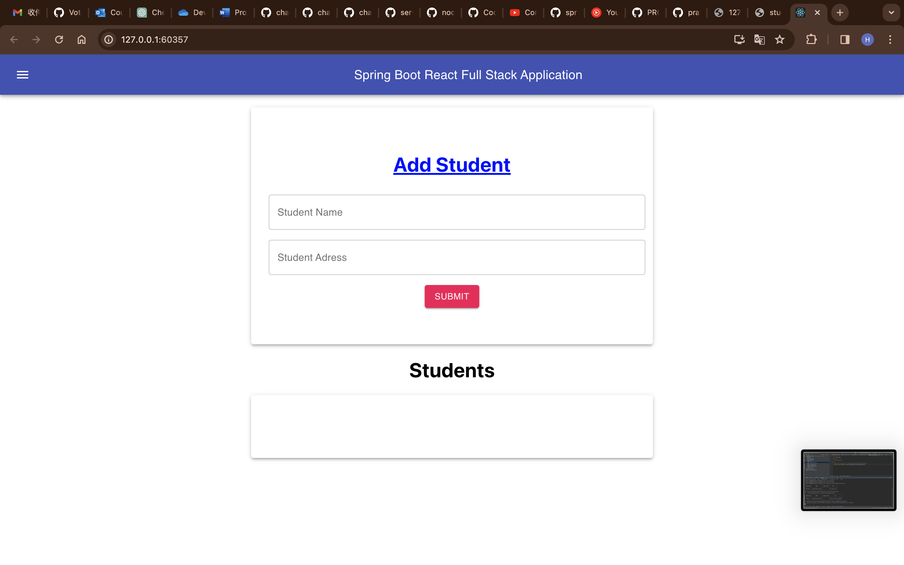

### 3.4. Add a local gateway using ingress
Set up Ingress on Minikube with the NGINX Ingress Controller
Enable the NGINX Ingress controller

    minikube addons enable ingress
Verify that the NGINX Ingress controller is running
Add the part of ingress in the app-deployment.yaml file and apply it

    kubectl apply -f app-deployment.yaml
Retrieve the IP address of Ingress

    kubectl get ingress
Edit the /etc/hosts file and add at the bottom values: 127.0.0.1  studentsystem
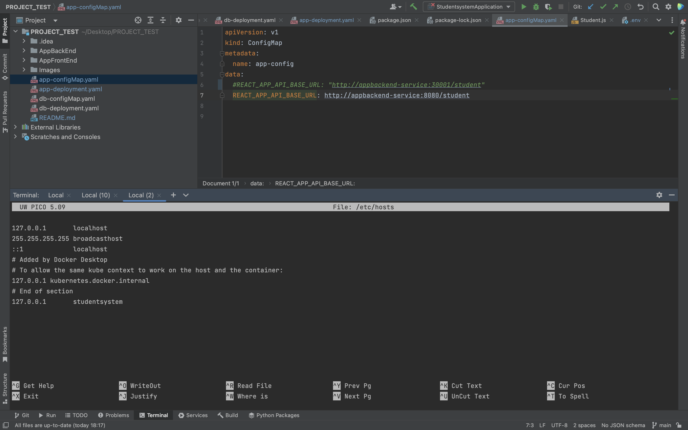
Enable a tunnel for Minikube
    
    minikube addons enable ingress-dns
    minikube tunnel
Check in the Web browser
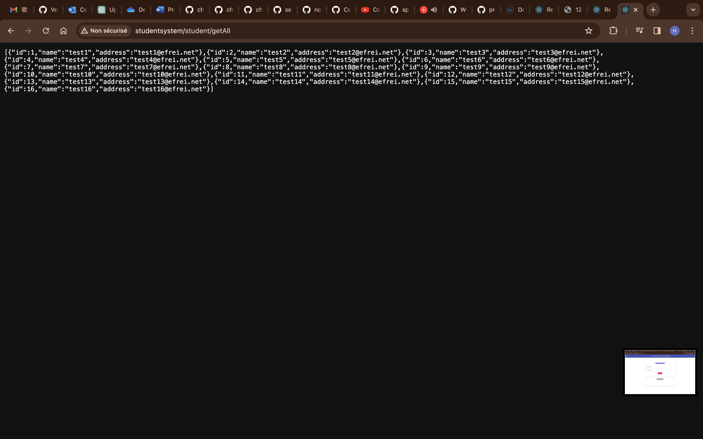
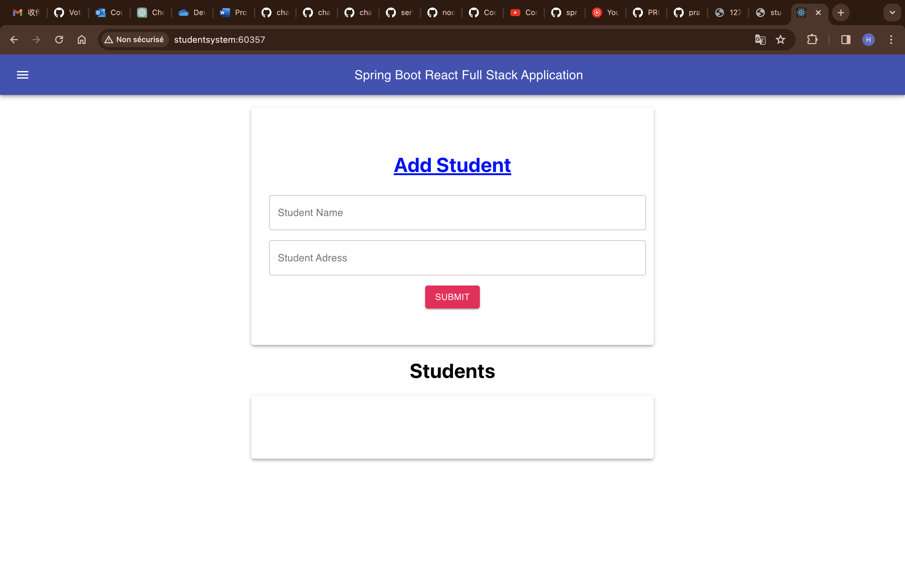
Add a new student via the web browser
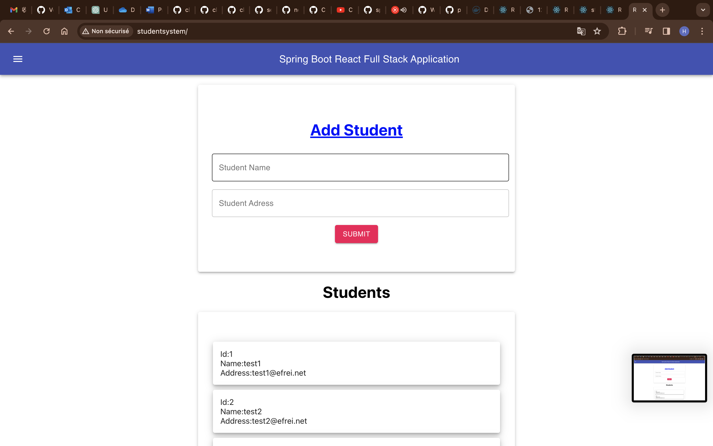

### 3.5. Continuous Integration with GitHub Actions
#### 3.5.1. Create the CI workflow
- Get Personal DockerHub access token as DOCKER_HUB_ACCESS_TOKEN
- Set two secrets of this GitHub repository under settings button: DOCKER_HUB_ACCESS_TOKEN, DOCKER_HUB_USERNAME
- Create a new directory named .github/workflows and a new actions.yaml
- Copy the content and make git commit and git push 
- Wait and verify the result on GitHub actions web page
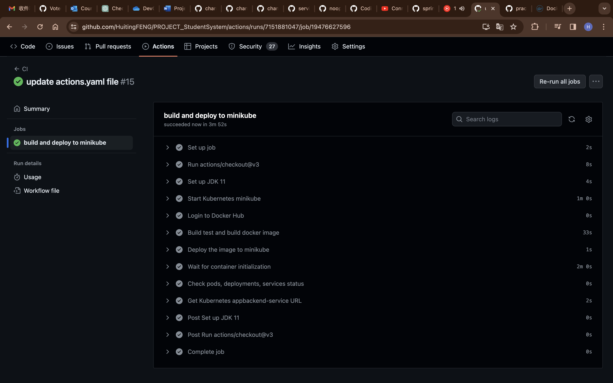

#### 3.5.2. Build and tests
Update the part of test under the AppBackEnd/src/test/resources/application.properties

#### 3.5.3. Launch a workflow when the code is updated
Check an existing workflow
    
    https://github.com/HuitingFENG/PROJECT_StudentSystem/actions
Add some jobs on the actions.yaml file and git commit push about mysql database connection

### 3.6. Deploy in a cloud infrastructure (Amazon Elastic Kubernetes Service)

### 3.7. Delete all
Delete all and stop minikube

    kubectl delete service appfrontend-service
    kubectl delete service appbackend-service
    kubectl delete service mysql
    kubectl delete deployment appfrontend-deployment
    kubectl delete deployment appbackend-deployment
    kubectl delete deployment mysql
    minikube stop

## 4. Google Labs
### 4.1. FOUR

### 4.2. FENG
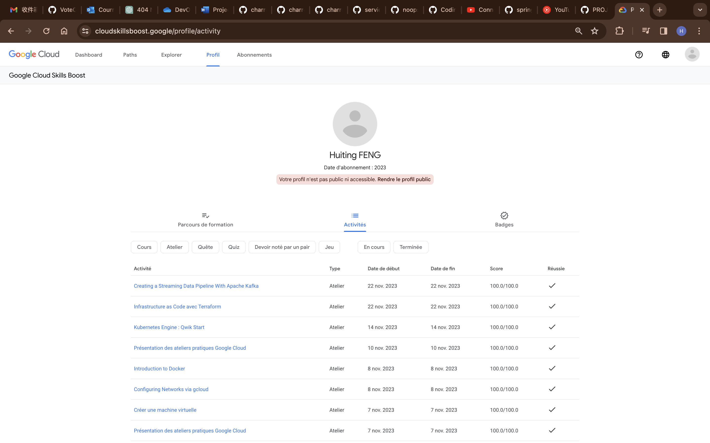

## 5. References
    https://www.youtube.com/watch?v=21V0w6pVYLY
    https://www.youtube.com/watch?v=GVY-zze0V_U
    https://github.com/charroux/servicemesh
    https://github.com/charroux/kubernetes-minikube
    https://github.com/charroux/noops
    https://github.com/charroux/CodingWithKubernetes
    https://github.com/Java-Techie-jt/springboot-crud-k8s

    

